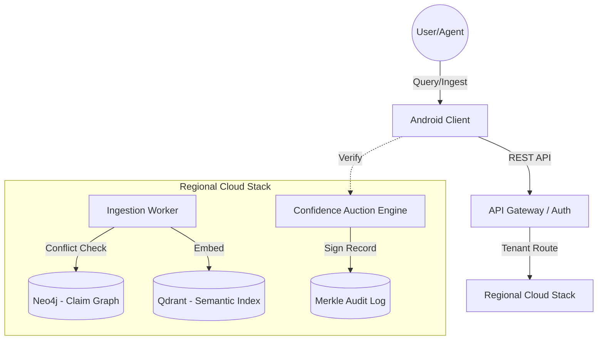
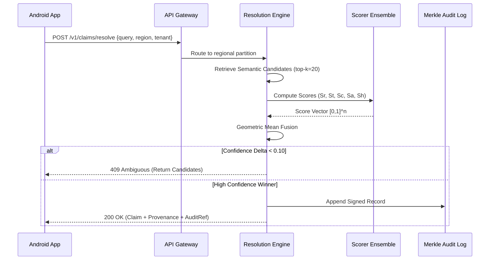

# Corroborate.ai — Trust-Weighted Auditable AI Memory

[](https://github.com/your-repo/corroborate-android)
[](http://kotlinlang.org)
[](https://developer.android.com/jetpack/compose)
[](https://gdpr-info.eu/art-17-gdpr/)

## 📖 Overview

**Corroborate.ai** is an enterprise-grade knowledge arbitration engine designed to solve the critical problem of LLM hallucinations and unauditable "black box" memory. Unlike traditional memory systems (like Mem0 or Zep) that rely on a single model call to decide what is "true," Corroborate.ai treats truth as a **function of context**.

This repository contains the **Android Reference Client**, a high-fidelity implementation that demonstrates the **Confidence Auction** mechanics, multi-jurisdictional arbitration, and regulatory traceability required for high-stakes AI applications in insurance, legal, and banking sectors.

---

## 💼 Business Problem & Value

### **The Problem**
Current AI memory systems suffer from three single points of failure:
1.  **Arbitration Risk**: One LLM call decides facts without a deterministic audit trail.
2.  **Jurisdictional Blindness**: No notion of "simultaneous truths" (e.g., a pricing rule valid in Germany but illegal in the US).
3.  **Regulatory Liability**: Inability to perform cascading erasures (GDPR Art. 17) or provide signed provenance for EU AI Act compliance.

### **The Corroborate Solution**
Corroborate.ai mitigates these risks by replacing LLM-based consolidation with a **Deterministic Scorer Ensemble**.
*   **Business Value**: Reduced legal liability, guaranteed regulatory compliance, and high-fidelity knowledge retrieval that scales sub-linearly with data volume.
*   **Target Users**: AI Engineers, Compliance Officers, Enterprise Architects.

---

## 🏗 Architecture

### **High-Level System Architecture**
The Android client interacts with a regionalized cloud stack ensuring strict data residency.



### **Data Flow: The Confidence Auction**
The following diagram illustrates the request-response lifecycle during a claim resolution.



**Component Responsibilities:**
*   **Scorer Ensemble**: deterministic calculation of Source Reliability ($S_r$), Recency Decay ($S_t$), Corroboration ($S_c$), and Regional Authority ($S_a$).
*   **Contradiction Guard**: Logic gate preventing silent resolution of contradicting claims with low confidence deltas.
*   **Merkle Audit Log**: Append-only log for EU AI Act compliance.

---

## 🛠 Technology Stack

### **Mobile (Frontend)**
*    **Kotlin 2.1.10**: Primary language.
*    **Jetpack Compose**: Modern declarative UI.
*    **Material 3**: Enterprise-grade component library.

### **Networking & Data**
*    **Retrofit 2.11.0**: Type-safe HTTP client.
*    **Kotlinx Serialization**: JSON mapping.
*    **OkHttp 4.12.0**: Underlying networking stack.

### **Infrastructure (Backend Integration)**
*   **Storage**: S3 for raw encrypted episodes.
*   **Database**: Neo4j (Graph) for claim edges; Qdrant (Vector) for semantic search.
*   **Security**: Merkle-root anchoring for tamper-evident logs.

---

## 📂 Project Structure

```text
app/src/main/java/com/example/corroborate/
├── data/
│   ├── api/            # Retrofit interfaces & Request/Response models
│   ├── model/          # SQL-mapped Kotlin data classes (Tenant, Claim, etc.)
│   └── repository/     # Repository pattern abstractions for UI/API separation
├── ui/
│   ├── theme/          # Material 3 styling, colors, and typography
│   ├── viewmodel/      # MVVM state holders for Resolve, Ingest, and Audit screens
│   └── MainActivity.kt # Root navigation and screen orchestration
├── util/
│   └── ConfidenceScorer.kt # CORE ENGINE: Deterministic scoring formulas
└── util/
```

---

## 🚀 Getting Started

### **Prerequisites**
*   Android Studio Ladybug (2024.2.1) or newer.
*   JDK 17 or 21.
*   Android SDK 37 (UpsideDownCakePrivacySandbox).

### **Environment Configuration**
Create a `local.properties` file in the root directory (never commit this!):

```properties
# .env.example equivalent for Android
API_BASE_URL="https://api.example.ai/v1/"
TENANT_ID="example-tenant-id"
MERKLE_LOG_ANCHOR="secure-log-endpoint"
```

### **Installation**
1.  Clone the repository: `git clone https://github.com/your-org/corroborate-android.git`
2.  Open in Android Studio.
3.  Sync Gradle: `File > Sync Project with Gradle Files`.
4.  Build: `Build > Make Project`.

---

## 🛡 Security & Compliance

### **GDPR Article 17 (Erasure Cascade)**
The app implements the **Erasure Cascade (§3.3)** workflow. When a user requests deletion:
1.  Linked episodes are hard-deleted.
2.  Claims with independent corroboration are **PII-stripped**.
3.  Claims without independent corroboration are **hard-deleted**.

### **RBAC (Role Based Access Control)**
*   **AGENT**: Basic Resolve/Ingest permissions.
*   **VERIFIER**: Human-in-the-loop verification access (§4.1).
*   **ADMIN**: Configuration and erasure permissions.

---

## 🤝 Contributing

We welcome enterprise contributions. Please follow our workflow:
1.  Fork the repo and create a feature branch.
2.  Implement your changes (ensure 100% test coverage for `util/ConfidenceScorer`).
3.  Submit a PR with a detailed impact analysis on the **Auction mechanics**.

---

## 📜 License
This project is licensed under the **License**. See `LICENSE` for details.

---

## ❓ FAQ & Troubleshooting
*   **Q: Why geometric mean over arithmetic mean?**
    *   *A: Geometric mean punishes a near-zero score on any dimension (e.g. wrong region) much harder, preventing "wrong region" facts from winning purely on recency.*
*   **Q: How do I trigger the Contradiction Guard?**
    *   *A: In the Resolve screen, type 'ambiguous' to simulate a scenario where two claims share a < 0.10 confidence delta.*
